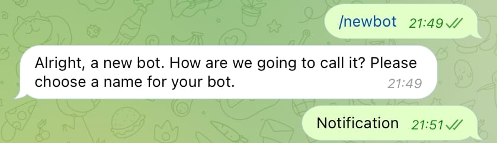
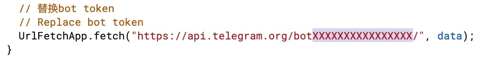
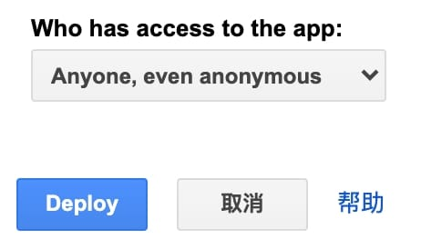

# Telegram-Group-Manager-Bot
Telegram小组管理机器人。

# 说明
[English](README.md) | [中文](README-zh.md)

# 功能
1. 进群欢迎
2. 根据username移除用户
3. 退群发送消息
4. 置顶消息提示信息
5. 根据关键词删除信息

# 创建Telegram机器人
1. Telegram 搜索 @BotFather
2. 发送命令 `/newbot`
3. 发送机器人名字.


4. 发送机器人的username，然后保存机器人的令牌。


# 使用方法
1. 创建一个Google脚本项目.
2. 设置机器人的令牌。

```JavaScript
UrlFetchApp.fetch("https://api.telegram.org/botXXXXXXXXXXXXXXXX/", data);
```
3. 发布 > 部署为网络应用... 权限选择 **Anyone, even anonymous**.


4. 保存网络应用的链接


5. 打开下面的链接。 需要替换机器人的令牌和网络应用的链接（链接需要被编码）。[编码转换工具](https://dev-coco.github.io/Online-Tools/Code-Conversion.html)

```https://api.telegram.org/botXXXXXXXXXXX/setWebhook?url=GoogleWebApp```

如果显示Webhook was set，就说明已经设置成功了。

```{"ok":true,"result":true,"description":"Webhook was set"}```

