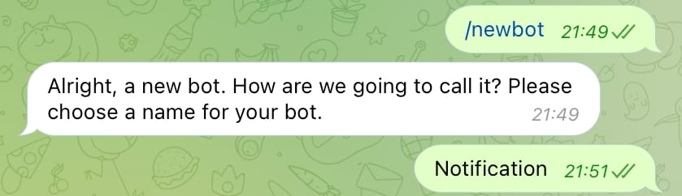
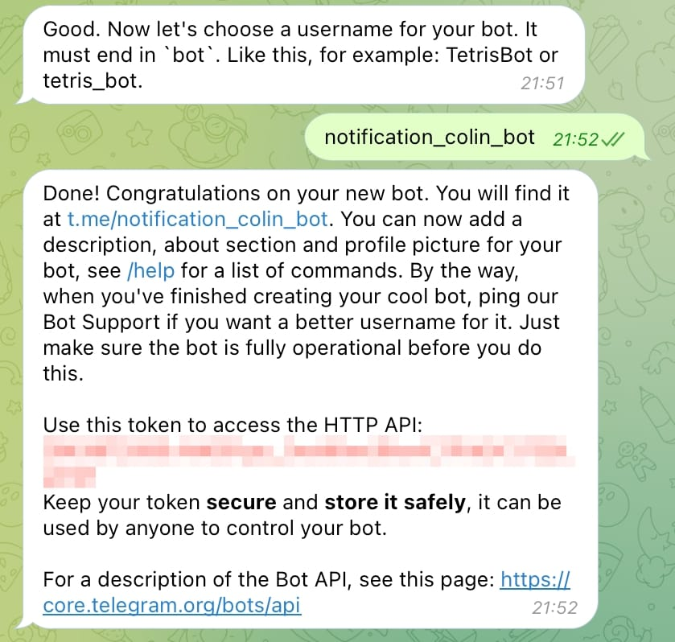
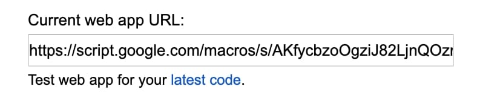

# Telegram-Group-Manager-Bot
Telegram Group Manager Bot. Telegram小组管理机器人。

# Features
1. Send welcome message
2. Remove users based on username
3. Quit group message
4. Pinned message
5. Delete information based on keywords

# Create Telegram bot
1. Telegram search @BotFather
2. Send command `/newbot`
3. Send bot name.


4. Send bot username and save bot token.


# Instructions
1. Create a Google Apps Script project.
2. Set bot token.

```JavaScript
UrlFetchApp.fetch("https://api.telegram.org/botXXXXXXXXXXXXXXXX/", data);
```
3. Publish > Deploy as web app... access select **Anyone, even anonymous**.


4. Save web app url


5. Open the link below. Need to replace bot token and web app url (need url encoded) [Code Conversion Tool](https://dev-coco.github.io/Online-Tools/Code-Conversion.html)

```https://api.telegram.org/botXXXXXXXXXXX/setWebhook?url=GoogleWebApp```

If Webhook was set is displayed, it means it has been set successfully.

```{"ok":true,"result":true,"description":"Webhook was set"}```
